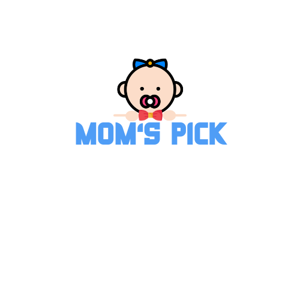

#  소개

## 프로젝트 소개

- 프로젝트명: 맘스픽(육아용품 중고거래 플랫폼)

- 프로젝트 기간: 2023-10-10 ~ 2023-11-17

- 주요 기능
    - 위치기반 거리별 판매 목록 조회
    - 육아정보 제공
    - 구매자와 판매자 간 채팅 기능

- 참조 리소스
    - 당근마켓
    - 맘맘
  

## 맘스픽

  
  <h3>맘스픽 Logo

## 화면 내용
|1-1. 로그인|1-2. 회원가입|
|:---:|:---:|
|||

|2. 메인페이지 |3. 검색 & 필터링|
|:---:|:---:|
|||

|4. 상세페이지|5. 채팅|
|:---:|:---:|
|||

|6-1. 육아정보|6-2. 육아정보|
|:---:|:---:|
|||

|7-1. 마이페이지|7-2. 마이페이지|
|:---:|:---:|
|||

## 팀원 소개

<table align="center">
    <tr align="center">
        <td>
            팀장/Backend/infra
        </td>
        <td>
            Backend/infra
        </td>
        <td>
            Backend/Data
        </td>
        <td>
            Frontend
        </td>
        <td>
            Frontend
        </td>
        <td>
            Frontend
        </td>
    </tr>
    <tr align="center">
     <td style="min-width: 150px;">
            <a href="https://github.com/wnsdlf925">
              
               
              <b>wnsdlf925</b>
            </a> 
        </td>
        <td style="min-width: 150px;">
            <a href="https://github.com/ji-hyon">
              
               
              <b>ji-hyon</b>
            </a>
        </td>
         <td style="min-width: 150px;">
            <a href="https://github.com/jhy1812">
              
               
              <b>jhy1812</b>
            </a> 
        </td>
        <td style="min-width: 150px;">
            <a href="https://github.com/JeBread">
              
               
              <b>JeBread</b>
            </a> 
        </td>
        <td style="min-width: 150px;">
            <a href="https://github.com/cjjss11">
              
               
              <b>cjjss11</b>
            </a> 
        </td>
        <td style="min-width: 150px;">
            <a href="https://github.com/ChoiCharles">
              
               
              <b>ChoiCharles</b>
            </a> 
        </td>
    </tr>
    <tr align="center">
        <td>
            권준일
        </td>
        <td>
            서지현
        </td>
        <td>
            정호윤
        </td>
        <td>
            방상제
        </td>
        <td>
            최지수
        </td>
        <td>
            최찬석
        </td>
    </tr>
</table>

### 담당 업무  

🙋🏻‍♂️ 권준일  

- 데이터베이스 스키마 설계
- CI/CD를 위한 젠킨스 파이프라인 구축
- 배포를 위한 인프라 구축
- 아기관련 CRUD API 개발
- 사용자 위치를 기반으로 거리별 물품 목록 조회 기능 개발
- ElasticSearch를 이용하여 검색 기능 개발
  
🙋🏻‍♂️ 서지현 

- 데이터베이스 스키마 설계  

🙋🏻‍♂️ 정호윤  

- 데이터베이스 스키마 설계  

🙋🏻‍♂️ 방상제  

- Figma 화면 설계 및 제작 ( 거래 화면, 검색 및 필터링 페이지, 판매글 상세 페이지 )
- Zustand 상태 관리 스토어 생성 with Next.js 13
- 판매글 추천 목록 조회 - swiper
- 판매글 등록 기능
- 판매글 필터링 ( 대분류, 중분류, 개월 중복 선택 ) - Elastic Search 에 query 요청
- 판매글 제목 검색 - Elastic Search 에 query 요청
- 설정 반경에 해당하는 판매글 목록 조회
- 판매글 상세 조회
- 판매글 찜 기능
- 형상 관리 ( Jira ) 

🙋🏻‍♂️ 최지수  

- 컴포넌트 설계 

🙋🏻‍♂️ 최찬석  

- 컴포넌트 설계 

## 사용 기술  

- java
- spring boot
- FastAPI
- JPA
- QueryDsl
- ElasticSearch
- MySql
- Redis
- React
- Next.js
 
